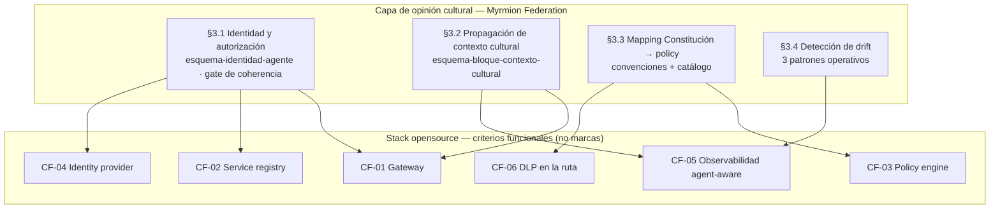
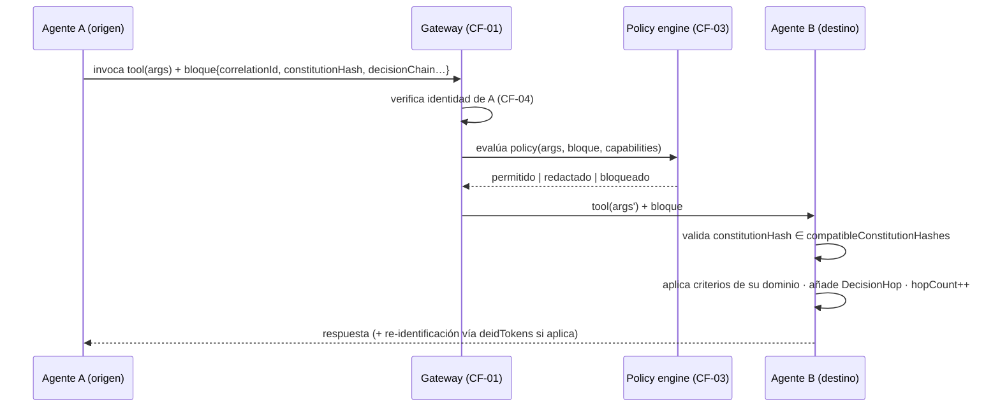
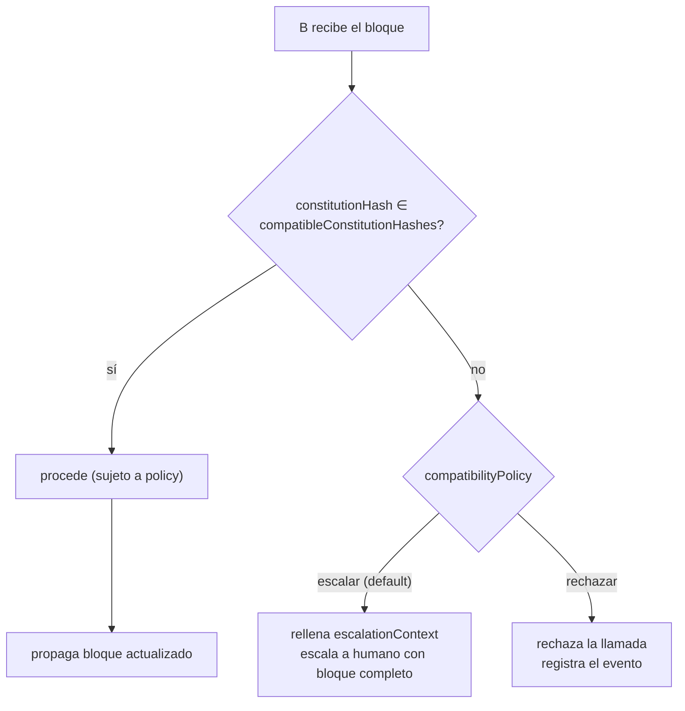
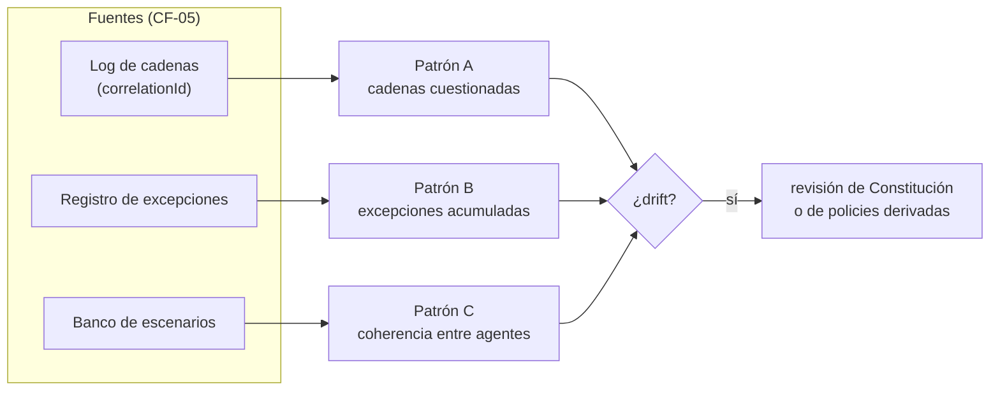

# Myrmion Federation — Guía de arquitectura funcional

**Versión 1.0**

*Desarrolla las cuatro capas funcionales del [manifiesto](./manifesto.md) §3 y muestra cómo se montan sobre los [criterios funcionales](./criterios-funcionales.md) del stack. Las capas son **funcionales, no físicas**: cada una puede materializarse en uno o varios componentes del stack subyacente. Esta guía es el mapa que conecta el porqué del manifiesto con los contratos (esquemas) y el método (convenciones, patrones, gobernanza).*

---

## 1. Las cuatro capas de un vistazo

Federation no es una pila de software: es una capa de opinión cultural que se monta sobre infraestructura opensource madura (manifiesto §2, compositividad). Las cuatro capas funcionales describen **qué** aporta esa opinión, no qué producto la implementa.

La frontera entre lo que esta guía describe (funcional) y los productos que lo implementan (concreto) la fija la [regla anti-acoplamiento](./regla-anti-acoplamiento.md).

---

## 2. §3.1 — Capa de identidad y autorización

**Qué hace.** Cada agente departamental se materializa como un servidor invocable con identidad criptográfica propia, registrado en el service registry. Las llamadas inter-agente se autentican mutuamente y cada tool pasa por un policy engine que decide si la llamada procede **antes** de ejecutarse.

**Qué aporta Federation encima del stack.** Un **esquema corporativo común** para la identidad y los descriptores de capacidades: el [esquema de identidad de agente](./esquema-identidad-agente.md). Sin ese esquema común, dos agentes pueden autenticarse correctamente y aun así ser incapaces de descubrirse y entenderse. Federation publica la [plantilla mínima](../../templates/federation/descriptor-agente.md) con los campos imprescindibles para el descubrimiento federado.

**Sobre qué se monta.** CF-01 (el gateway intermedia y aplica policy), CF-02 (el registry almacena descriptores extendidos), CF-04 (el IdP emite identidades criptográficas). El **gate de coherencia** —la verificación programática que un agente nuevo pasa antes de registrarse— se desarrolla en [gobernanza-federada.md](./gobernanza-federada.md).

---

## 3. §3.2 — Capa de propagación de contexto cultural

**Qué hace.** Cuando A invoca a B, además de los argumentos de la tool viaja el [bloque de contexto cultural](./esquema-bloque-contexto-cultural.md): versión de Constitución aplicada, caso de negocio, capas departamentales activas, cadena de decisiones previa y un `correlationId` que persiste toda la cadena. B valida compatibilidad, aplica sus propios criterios y propaga el bloque actualizado.

**Secuencia de una llamada inter-agente** (el caso normal, compatible):

**El caso límite — incompatibilidad de Constitución:**

**Sobre qué se monta.** CF-01 (el gateway propaga los metadatos del bloque sin truncarlos) y CF-05 (la observabilidad traza la cadena por `correlationId`). **El esquema del bloque está en el cuerpo; el transporte —cómo viaja por cada protocolo— vive en [`appendix/mapeo-transporte/`](./appendix/mapeo-transporte/)** (manifiesto §3.2: «define el esquema, no la transporte»).

---

## 4. §3.3 — Capa de mapping Constitución → policy

**Qué hace.** Traduce los principios automatizables de la Constitución Corporativa —documento en lenguaje natural— a policies que un policy engine evalúa en runtime. Federation define las **convenciones** del mapping, no las policies concretas.

**Qué aporta Federation.** Las [convenciones de mapping](./convenciones-mapping-constitucion-policy.md) (taxonomía de automatizabilidad + procedimiento) y el **formato** de la [ficha de policy template](../../templates/federation/ficha-policy-template.md). El **catálogo poblado** con implementaciones por dialecto es comunidad y vive en [`appendix/policy-templates/`](./appendix/policy-templates/), desacoplado para que el cuerpo no envejezca con cada release de motor.

**Caso canónico que cierra el hueco de Adoption.** La des-identificación de datos sensibles (CF-06) es un patrón de este mapping: la redacción inline en la ruta del prompt que en Adoption exigía un intermediario inexistente, y que aquí es nativa (ver [Guía de protección de datos](../adoption/guia-proteccion-datos.md) §3.4 y el campo `deidTokens` del [bloque](./esquema-bloque-contexto-cultural.md)).

**Sobre qué se monta.** CF-03 (evaluación declarativa en runtime) y CF-06 (des-identificación en la ruta). **No todo principio es traducible**: las restricciones operativas sí, los criterios de decisión finos no (manifiesto §3.3, §8). El resto sigue siendo trabajo de modelado en cada agente, igual que en Adoption.

---

## 5. §3.4 — Capa de detección de drift cultural

**Qué hace.** Detecta patrones sistemáticos en el comportamiento agregado del sistema que no se derivan de la Constitución vigente. El drift federado solo emerge al mirar el sistema entero; las métricas técnicas habituales no lo capturan.

**Qué aporta Federation.** Tres [patrones operativos](./patrones-deteccion-drift.md): análisis de cadenas de decisiones (sobre el log de `correlationId`), análisis de excepciones acumuladas y análisis de coherencia entre agentes. Son **procesos, no productos**: Federation articula qué medir, cómo y con qué frecuencia; el dashboard lo aporta el stack.

**Sobre qué se monta.** CF-05 (la observabilidad que permite las tres consultas). Las métricas que cuantifican si todo funciona están en [metricas-federacion.md](./metricas-federacion.md).

---

## 6. Lo transversal: el `correlationId` y la compositividad

Dos ideas atraviesan las cuatro capas:

- **El `correlationId` es el hilo.** Nace en el primer salto, viaja en el bloque (§3.2), se graba en cada `DecisionHop`, se exporta a observabilidad (CF-05) y es la clave con la que el Patrón A reconstruye cadenas. Es la pieza que vuelve trivial la trazabilidad que en Adoption era forense.
- **Compositividad, no reimplementación.** Ninguna de las cuatro capas reimplementa policy enforcement, identidad, audit, registry u observabilidad: se montan encima de lo que el stack ya da. Federation aporta el puente entre la Constitución Corporativa y la gobernanza programática — lo que ningún proyecto técnico está cosiendo (manifiesto §2).

Para elegir el stack que cumple los seis criterios, ver [criterios-funcionales.md](./criterios-funcionales.md) y las fichas de [`appendix/stacks-referencia/`](./appendix/stacks-referencia/). Para la secuencia de adopción, [guia-adopcion-por-fases.md](./guia-adopcion-por-fases.md).

---

*Guía de arquitectura funcional de Myrmion Federation — versión 1.0. Parte del corpus normativo. Los diagramas son Mermaid vendor-neutral; ningún producto aparece en ellos por diseño ([regla anti-acoplamiento](./regla-anti-acoplamiento.md)).*
