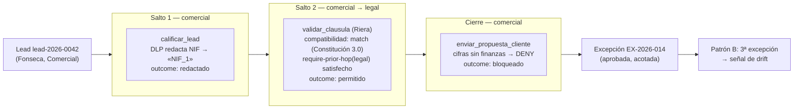

# Myrmion Federation — Ejemplo end-to-end: corredor Comercial → Legal

**Versión 1.0**

*El recorrido completo de un corredor real de **Consultora Modelo S.L.** (organización ficticia del corpus), anonimizado y coherente entre sí: descriptores, bloques de contexto cultural, policies disparadas, una excepción y una señal de drift. Materializa el corredor del [manifiesto](../../../docs/federation/manifesto.md) §6 (Fase 3) y sirve de prueba de coherencia contra los esquemas del cuerpo. No es normativo: ilustra cómo encajan las piezas.*

---

## El caso

Un **lead** entra al equipo comercial de Consultora Modelo S.L. **Fonseca** (Comercial) lo califica con ayuda del agente comercial. Para cerrar la propuesta hace falta validar una cláusula de responsabilidad; ese juicio es jurídico, así que el corredor pasa por **Riera** (Legal) a través del agente legal. Al final, el comercial intenta enviar la propuesta al cliente.

El caso de negocio es `lead-2026-0042`. Toda la cadena comparte un único `correlationId`: `550e8400-e29b-41d4-a716-446655440000`.

---

## Los saltos

| Salto | Origen → destino | Tool | Decisión de policy | `outcome` | Artefacto del bloque |
|---|---|---|---|---|---|
| 1 | comercial (origen) | `calificar_lead` | `redact` (DLP/PII) | `redactado` | [`bloque/hop-1.json`](./bloque/hop-1.json) |
| 2 | comercial → legal | `validar_clausula` | `require-prior-hop(legal)` satisfecho | `permitido` | [`bloque/hop-2.json`](./bloque/hop-2.json) |
| cierre | comercial (origen) | `enviar_propuesta_cliente` | `deny` (cifras sin finanzas) | `bloqueado` | (corte: se rellena `escalationContext`) |

El **salto 1** nace la cadena (`hopCount: 1`): el agente comercial califica el lead y la capa de des-identificación redacta el NIF del contacto **antes** de que cruce nada. El **salto 2** (`hopCount: 2`) invoca al agente legal porque `enviar_propuesta_cliente` tiene `canCommit: true` y la policy de paso por legal lo exige; el agente legal valida compatibilidad de Constitución (hay match), valida la cláusula y devuelve `permitido`, añadiendo su eslabón a la `decisionChain`. En el **cierre**, el comercial intenta enviar la propuesta y la policy de cifras sin finanzas la **bloquea**: ahí entra la excepción.

---

## Los artefactos

### Descriptores de identidad

Válidos contra el [esquema de identidad de agente](../../../docs/federation/esquema-identidad-agente.md). Ambos heredan de la Constitución 3.0 y comparten su hash, lo que hace que la validación de compatibilidad del salto 2 dé match.

- [`descriptores/comercial.agente.yaml`](./descriptores/comercial.agente.yaml) — `urn:myrmion:agent:consultora-modelo:comercial:propuestas`. `enviar_propuesta_cliente` con `externalizes: true` y `canCommit: true` es lo que dispara las policies del corredor. `dependsOn` referencia al legal.
- [`descriptores/legal.agente.yaml`](./descriptores/legal.agente.yaml) — `urn:myrmion:agent:consultora-modelo:legal:dictamenes`. `criticality: alta`. Su `compatibleConstitutionHashes` contiene el hash de la Constitución 3.0 que el comercial aplica.

### Bloques de contexto cultural

Válidos contra el [esquema del bloque de contexto cultural](../../../docs/federation/esquema-bloque-contexto-cultural.md). **Mismo `correlationId`** en ambos.

- [`bloque/hop-1.json`](./bloque/hop-1.json) — `hopCount: 1`. Sin `decisionChain` (es el primer salto). Lleva el `deidToken` `«NIF_1»` emitido por la redacción reversible.
- [`bloque/hop-2.json`](./bloque/hop-2.json) — `hopCount: 2`. `decisionChain` presente y obligatoria, con el eslabón del salto 1 (`criteriaApplied` mezcla `policyId@version` y el literal `juicio-de-modelo-no-automatizable`). El `deidToken` viaja para que la respuesta final se re-identifique solo en el origen.

### Policies disparadas

Qué se disparó en cada salto y con qué efecto (incluye un bloqueo).

- [`policies-disparadas/dlp-redaccion.md`](./policies-disparadas/dlp-redaccion.md) — salto 1: `redact` reversible del NIF ([CF-06](../../../docs/federation/criterios-funcionales.md)).
- [`policies-disparadas/exigir-paso-legal.md`](./policies-disparadas/exigir-paso-legal.md) — salto 2: `require-prior-hop(legal)`, que es lo que provoca la invocación al agente legal ([CF-03](../../../docs/federation/criterios-funcionales.md)).
- [`policies-disparadas/bloqueo-cifras.md`](./policies-disparadas/bloqueo-cifras.md) — cierre: `deny` terminal por cifras sin endorsement de finanzas. **Este es el bloqueo del ejemplo.**

### Excepción y señal de drift

- [`excepcion/EX-2026-014.md`](./excepcion/EX-2026-014.md) — la excepción que levantó el bloqueo de cifras: justificación, alcance acotado y autorizador trazable, en el formato del [registro de excepciones](../../../templates/federation/registro-excepciones.md).
- [`senal-drift.md`](./senal-drift.md) — el [Patrón B](../../../docs/federation/patrones-deteccion-drift.md) detecta que ésta es la tercera excepción a la misma policy en el trimestre: señal de drift y revisión propuesta de la policy.

---

## Coherencia (lo que cuadra entre artefactos)

Este ejemplo está construido para que las claves crucen sin contradicción:

- **`agentId`** — el del descriptor comercial aparece en `dependsOn` del comercial y en cada `DecisionHop` del bloque; el del legal es el destino del salto 2.
- **`correlationId`** — `550e8400-e29b-41d4-a716-446655440000` es idéntico en `hop-1.json`, `hop-2.json`, la excepción y la señal de drift.
- **`businessCaseId`** — `lead-2026-0042` en ambos bloques.
- **Hashes** — `constitutionHash` del bloque == `constitutionRef.hash` de ambos descriptores == un miembro de `compatibleConstitutionHashes` del legal. Por eso el salto 2 da **match** y procede. Los hashes son ilustrativos; su contrato de cálculo está en [esquema-identidad-agente.md §6](../../../docs/federation/esquema-identidad-agente.md#6-contrato-de-hash) (UTF-8 NFC, LF, sin trailing whitespace, excluyendo la sección «0. Metadatos»).
- **Policy IDs** — `pol-cifras-sin-finanzas@1.1` aparece en el bloqueo, en la excepción y en la señal de drift; `pol-dlp-pii@2.0` y `pol-calificacion-lead@1.2` aparecen en `criteriaApplied` del salto 1.

Todo el ejemplo es vendor-neutral: ningún nombre de producto aparece aquí. Lo concreto (cómo se serializa el bloque, qué motor de DLP redacta, qué dialecto expresa cada policy) vive en el [apéndice](../../../docs/federation/appendix/README.md).

---

*Ejemplo del corredor comercial→legal de Myrmion Federation — versión 1.0. Parte del corpus (material de ejemplo, no normativo). Sus contratos son el [esquema de identidad de agente](../../../docs/federation/esquema-identidad-agente.md) y el [esquema del bloque de contexto cultural](../../../docs/federation/esquema-bloque-contexto-cultural.md); sus plantillas socráticas, [descriptor-agente.md](../../../templates/federation/descriptor-agente.md) y [bloque-contexto-cultural.md](../../../templates/federation/bloque-contexto-cultural.md).*
