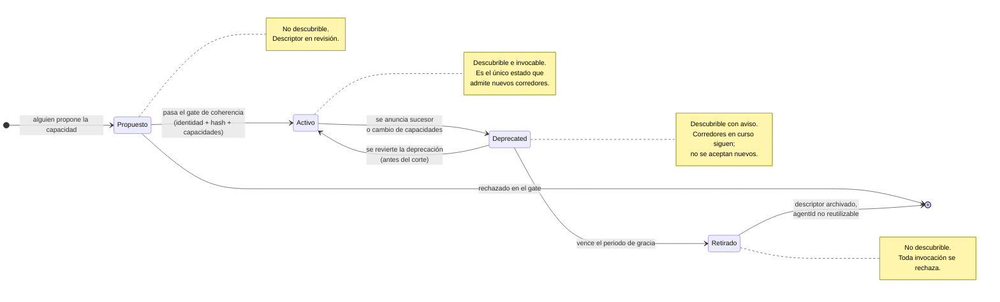

# Myrmion Federation — Diagrama: ciclo de vida del agente

**Versión 1.0**

*Materializa el §5 (gobernanza) y §6 (fases) del [manifiesto](../../../docs/federation/manifesto.md): un agente departamental no es eterno; transita por estados gobernados —propuesto, activo, deprecated, retirado— y cada transición deja traza.*

Este diagrama acompaña al [ejemplo del corredor comercial→legal](../corredor-comercial-legal/README.md) y a la [guía de arquitectura funcional](../../../docs/federation/guia-arquitectura-funcional.md). Describe la vida del agente Legal de **Consultora Modelo S.L.** (`legal:dictamenes`, cuyo custodio es **Riera**) desde que alguien lo propone hasta que se retira, y cómo su estado condiciona su descubribilidad. El ciclo es **funcional**: no presupone ninguna herramienta de gestión concreta. Se corresponde con el campo `lifecycleStatus` del descriptor de identidad (§8).

## Por qué hay ciclo de vida

El [gate de coherencia](./gate-coherencia-registro.md) decide *si* un agente entra. El ciclo de vida decide *cuánto tiempo* sigue siendo legítimo invocarlo y *cómo* se le da salida sin romper los corredores existentes. Sin ciclo de vida, un cambio en `legal:dictamenes` rompería en silencio la propuesta de `comercial:propuestas`; con él, la deprecación es anunciada, trazada y reversible hasta el corte.

## Estados y transiciones

## Qué significa cada estado para la federación

| Estado | ¿Descubrible? | ¿Acepta nuevos corredores? | ¿Corredores en curso? |
|--------|---------------|----------------------------|------------------------|
| Propuesto | No | No | — |
| Activo | Sí | Sí | Sí |
| Deprecated | Sí, con aviso | No | Sí, hasta el corte |
| Retirado | No | No | No (se rechazan) |

### Notas de lectura

- **El gate es la entrada a `activo`.** La transición `propuesto → activo` es exactamente el [gate de coherencia del registro](./gate-coherencia-registro.md). No hay otra forma de volverse descubrible.
- **`deprecated` es un estado, no un borrado.** Mientras esté `deprecated`, el agente sigue respondiendo a los corredores que ya lo usaban —para no romper, por ejemplo, una validación legal a medias del [corredor comercial→legal](./secuencia-corredor.md)— pero el registro deja de ofrecerlo para corredores nuevos. Es el periodo de gracia que permite migrar al sucesor de forma ordenada.
- **La deprecación es reversible; el retiro no.** Antes del corte se puede volver a `activo`. Al retirar (ver [esquema de identidad](../../../docs/federation/esquema-identidad-agente.md) §8: deregister, revocar `identityRef`, archivar histórico, notificar a quienes lo tienen en `dependsOn`), el descriptor se archiva y el `agentId` **no se reutiliza**: reutilizarlo crearía una colisión de identidad y reabriría trazas históricas a un agente distinto.
- **Cada transición deja traza.** Igual que los saltos del corredor encadenan `DecisionHop`, los cambios de estado se asientan para que la gobernanza (§5) pueda reconstruir quién promovió, depreció o retiró un agente y por qué.
- **El `agentId` sobrevive al estado.** `urn:myrmion:agent:consultora-modelo:legal:dictamenes` identifica al mismo agente en los cuatro estados; lo que cambia es su descubribilidad y su legitimidad de invocación, no su identidad. El segmento `<nombre>` nombra la función del agente, no a la persona (Riera es su custodio).

---

*Diagrama: ciclo de vida del agente — versión 1.0. Parte del corpus normativo.*

**Relacionado:** [ejemplo del corredor](../corredor-comercial-legal/README.md) · [guía de arquitectura funcional](../../../docs/federation/guia-arquitectura-funcional.md) · [gate de coherencia del registro](./gate-coherencia-registro.md) · [esquema de identidad de agente](../../../docs/federation/esquema-identidad-agente.md)
