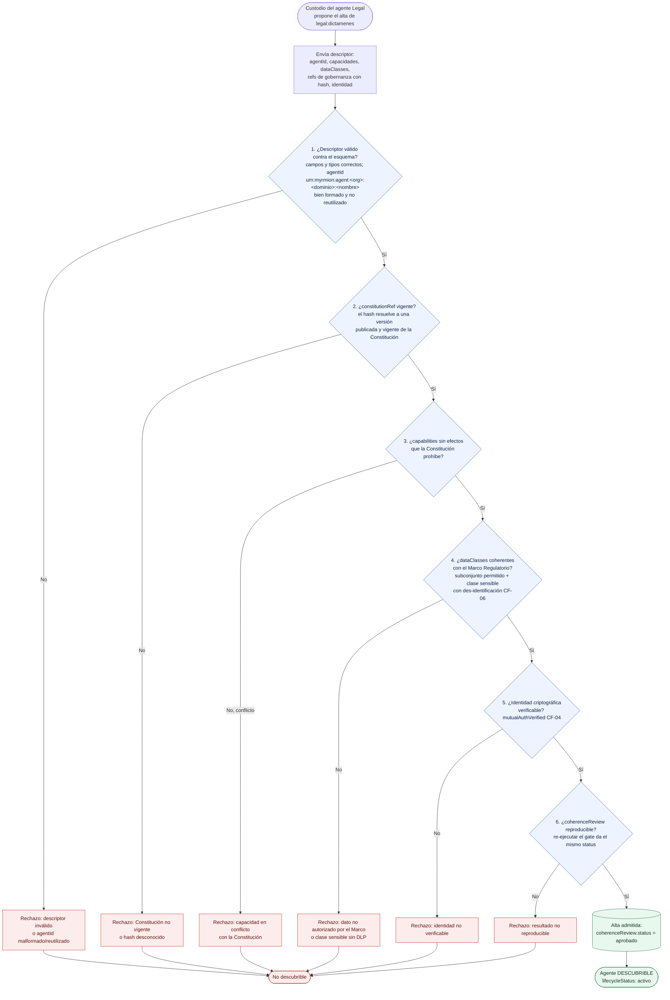

# Myrmion Federation — Diagrama: alta de agente y gate de coherencia del registro

**Versión 1.0**

*Materializa el §4 (criterios) y §5 (gobernanza) del [manifiesto](../../../docs/federation/manifesto.md): un agente solo entra en la federación si su descriptor pasa el gate de coherencia del registro, que verifica las **seis comprobaciones** de [gobernanza §2.1](../../../docs/federation/gobernanza-federada.md) antes de hacerlo descubrible.*

Este diagrama acompaña al [ejemplo del corredor comercial→legal](../corredor-comercial-legal/README.md) y a la [guía de arquitectura funcional](../../../docs/federation/guia-arquitectura-funcional.md). Describe el momento previo a cualquier corredor: cómo el agente Legal de **Consultora Modelo S.L.** (`legal:dictamenes`, cuyo custodio es **Riera**) se da de alta para que el agente Comercial pueda descubrirlo. El gate es **funcional**, no un producto de registro concreto; el mapeo a un service registry real vive en el apéndice.

> El `agentId` nombra la **función** del agente (`dictamenes`), no a la persona. Riera es el custodio humano (`owner`) que propone el alta.

## El caso

Antes de que el corredor del [diagrama de secuencia](./secuencia-corredor.md) pueda funcionar, el agente de Legal tiene que existir en el registro y pasar el gate de coherencia: las **seis comprobaciones** que [gobernanza §2.1](../../../docs/federation/gobernanza-federada.md) define — descriptor válido (incl. `agentId` bien formado y no reutilizado), `constitutionRef` vigente, capacidades sin efectos vetados por la Constitución, `dataClasses` coherentes con el **Marco Regulatorio**, identidad criptográfica verificable y `coherenceReview` reproducible. El gate es **bloqueante y atómico**: si **cualquiera** de las seis falla, el alta falla y el agente nunca llega a ser descubrible.

## El gate

## Qué comprueba cada compuerta (contrato, no implementación)

| # | Compuerta | Comprobación | Contrato / criterio |
|---|-----------|--------------|---------------------|
| 1 | Descriptor válido | Campos requeridos y tipos correctos; `agentId` con forma `urn:myrmion:agent:<org>:<dominio>:<nombre>`, bien formado y **no reutilizado** | [esquema de identidad](../../../docs/federation/esquema-identidad-agente.md) §2–§3 |
| 2 | `constitutionRef` vigente | El `hash` resuelve a una versión **publicada y vigente** de la Constitución (no borrador ni retirada), según el [contrato de hash](../../../docs/federation/esquema-identidad-agente.md#6-contrato-de-hash) (UTF-8 NFC + LF + sin *trailing whitespace* + **excluida** la sección "0. Metadatos") | esquema §6 · gobernanza §2.1 |
| 3 | Capacidades vs Constitución | Ninguna `capability` declara un efecto que la Constitución veta de forma absoluta (p. ej. `canCommit` sin paso por legal) | [gobernanza](../../../docs/federation/gobernanza-federada.md) §2.1 · manifiesto §5 |
| 4 | `dataClasses` vs Marco | Las clases de dato son subconjunto de las que el **Marco Regulatorio** autoriza al dominio; cada clase sensible (PII/PHI) tiene des-identificación en la ruta | [CF-06](../../../docs/federation/criterios-funcionales.md) · gobernanza §2.1 |
| 5 | Identidad verificable | Identidad criptográfica verificable (`mutualAuthVerified`) — las tres propiedades de [CF-04](../../../docs/federation/criterios-funcionales.md) | CF-04 |
| 6 | `coherenceReview` reproducible | Re-ejecutar el gate sobre el mismo descriptor y estado produce el mismo `status`; se sella en `coherenceReview` | [gobernanza](../../../docs/federation/gobernanza-federada.md) §2.1 |

### Notas de lectura

- **El gate es la única puerta de entrada.** No hay descubrimiento "informal": un agente que no pasa el gate sencillamente no aparece en el registro y, por tanto, ningún corredor lo encuentra. Esto es lo que hace que el descubrimiento del [diagrama de secuencia](./secuencia-corredor.md) sea fiable.
- **El hash sella el contenido cultural, no los metadatos.** La sección "0. Metadatos del documento" se excluye de la forma canónica a propósito: cambiar una fecha de revisión o un responsable no debe invalidar la referencia. Lo que el hash protege es la sustancia (lo que dice la Constitución, la Capa o el Marco), no su cabecera administrativa.
- **Coherencia ≠ confianza eterna.** Pasar el gate deja `coherenceReview.status = aprobado` y hace al agente *descubrible y activo*; mantenerlo ahí depende del [ciclo de vida](./ciclo-vida-agente.md). Un cambio en `capabilities`, `constitutionRef` o `dataClasses` re-dispara el gate.
- **El registro es funcional.** "Registro de capacidades" es la capa, no el producto. Un service registry concreto que la implemente se documenta en el apéndice; el contrato aquí es *qué tiene que verificar el gate*, no con qué pieza.
- **Org de ejemplo.** El `agentId` resultante es `urn:myrmion:agent:consultora-modelo:legal:dictamenes`. La parte `<org>` la fija cada organización; el segmento `<nombre>` nombra la función del agente, no a la persona (Riera es su custodio).

---

*Diagrama: alta de agente y gate de coherencia del registro — versión 1.0. Parte del corpus normativo.*

**Relacionado:** [ejemplo del corredor](../corredor-comercial-legal/README.md) · [guía de arquitectura funcional](../../../docs/federation/guia-arquitectura-funcional.md) · [esquema de identidad de agente](../../../docs/federation/esquema-identidad-agente.md) · [ciclo de vida del agente](./ciclo-vida-agente.md)
