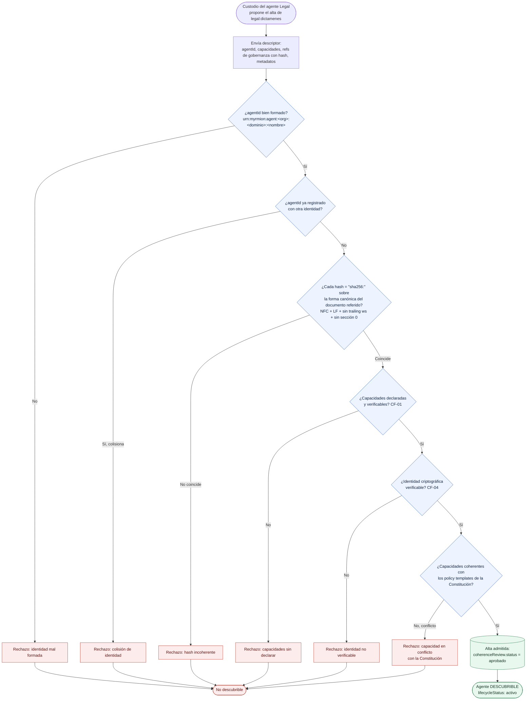

# Myrmion Federation — Diagrama: alta de agente y gate de coherencia del registro

**Versión 1.0**

*Materializa el §4 (criterios) y §5 (gobernanza) del [manifiesto](../../../docs/federation/manifesto.md): un agente solo entra en la federación si su descriptor pasa el gate de coherencia del registro, que ata identidad, capacidades y hash antes de hacerlo descubrible.*

Este diagrama acompaña al [ejemplo del corredor comercial→legal](../corredor-comercial-legal/README.md) y a la [guía de arquitectura funcional](../../../docs/federation/guia-arquitectura-funcional.md). Describe el momento previo a cualquier corredor: cómo el agente Legal de **Consultora Modelo S.L.** (`legal:dictamenes`, cuyo custodio es **Riera**) se da de alta para que el agente Comercial pueda descubrirlo. El gate es **funcional**, no un producto de registro concreto; el mapeo a un service registry real vive en el apéndice.

> El `agentId` nombra la **función** del agente (`dictamenes`), no a la persona. Riera es el custodio humano (`owner`) que propone el alta.

## El caso

Antes de que el corredor del [diagrama de secuencia](./secuencia-corredor.md) pueda funcionar, el agente de Legal tiene que existir en el registro y ser **coherente**: que su `agentId` esté bien formado, que los `hash` de sus referencias de gobernanza correspondan a la forma canónica de cada documento, que sus capacidades estén declaradas y que no colisione con otra identidad ya registrada. Además, el gate evalúa esas capacidades declaradas contra los policy templates derivados de la Constitución: si entran en conflicto, el alta falla. El gate rechaza todo lo que no encaje; un descriptor incoherente nunca llega a ser descubrible.

## El gate

## Qué comprueba cada compuerta (contrato, no implementación)

| Compuerta | Comprobación | Contrato / criterio |
|-----------|--------------|---------------------|
| `agentId` bien formado | URN con la forma `urn:myrmion:agent:<org>:<dominio>:<nombre>` | [esquema de identidad de agente](../../../docs/federation/esquema-identidad-agente.md) §2 |
| Sin colisión | El `agentId` no apunta a una identidad distinta ya sellada (no se reutilizan) | [esquema de identidad](../../../docs/federation/esquema-identidad-agente.md) §2 |
| Hash coherente | Cada `hash` de referencia (`constitutionRef`, `departmentLayerRef`, `regulatoryFrameworkRef`) = `"sha256:"` sobre la forma canónica del documento (UTF-8 NFC + LF + sin *trailing whitespace* + **excluida** la sección "0. Metadatos") | [contrato de hash](../../../docs/federation/esquema-identidad-agente.md#6-contrato-de-hash) |
| Capacidades declaradas | Las capacidades y sus propiedades de gobernanza (`sideEffectClass`, `externalizes`, `canCommit`) son explícitas | CF-01 |
| Identidad verificable | Identidad criptográfica verificable (`mutualAuthVerified`) — una de las tres propiedades de CF-04 | CF-04 |
| Coherencia con la Constitución | Las capacidades no entran en conflicto con los policy templates derivados de la Constitución; si lo hacen, el alta falla | [gobernanza federada](../../../docs/federation/gobernanza-federada.md) · manifiesto §5 |

### Notas de lectura

- **El gate es la única puerta de entrada.** No hay descubrimiento "informal": un agente que no pasa el gate sencillamente no aparece en el registro y, por tanto, ningún corredor lo encuentra. Esto es lo que hace que el descubrimiento del [diagrama de secuencia](./secuencia-corredor.md) sea fiable.
- **El hash sella el contenido cultural, no los metadatos.** La sección "0. Metadatos del documento" se excluye de la forma canónica a propósito: cambiar una fecha de revisión o un responsable no debe invalidar la referencia. Lo que el hash protege es la sustancia (lo que dice la Constitución, la Capa o el Marco), no su cabecera administrativa.
- **Coherencia ≠ confianza eterna.** Pasar el gate deja `coherenceReview.status = aprobado` y hace al agente *descubrible y activo*; mantenerlo ahí depende del [ciclo de vida](./ciclo-vida-agente.md). Un cambio en `capabilities`, `constitutionRef` o `dataClasses` re-dispara el gate.
- **El registro es funcional.** "Registro de capacidades" es la capa, no el producto. Un service registry concreto que la implemente se documenta en el apéndice; el contrato aquí es *qué tiene que verificar el gate*, no con qué pieza.
- **Org de ejemplo.** El `agentId` resultante es `urn:myrmion:agent:consultora-modelo:legal:dictamenes`. La parte `<org>` la fija cada organización; el segmento `<nombre>` nombra la función del agente, no a la persona (Riera es su custodio).

---

*Diagrama: alta de agente y gate de coherencia del registro — versión 1.0. Parte del corpus normativo.*

**Relacionado:** [ejemplo del corredor](../corredor-comercial-legal/README.md) · [guía de arquitectura funcional](../../../docs/federation/guia-arquitectura-funcional.md) · [esquema de identidad de agente](../../../docs/federation/esquema-identidad-agente.md) · [ciclo de vida del agente](./ciclo-vida-agente.md)
